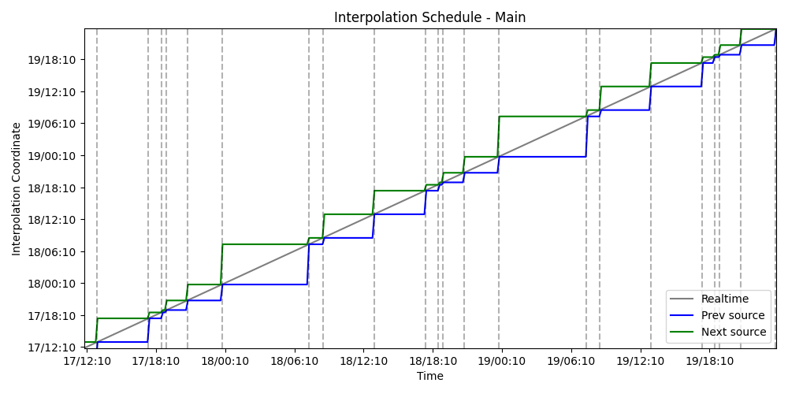
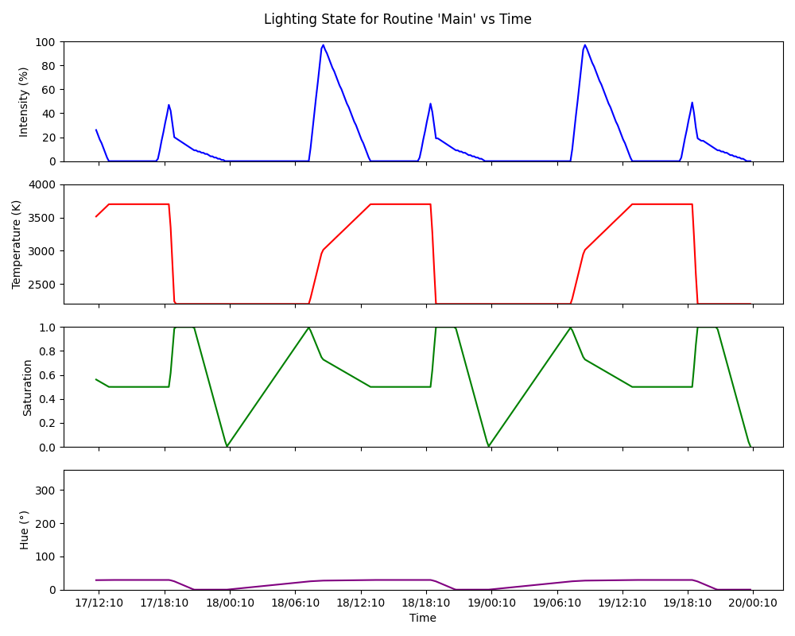

# lighting

A script that animates IKEA TRADFRI lights (via Dirigera hub) based on a list of keypoints. Each keypoint
is a collection of a color temperature (2202 - 4000K), a light intensity (0 - 100%), a hue (0 - 360), and
a saturation (0 - 100). The keypoints are associated with a timestamp in one of two forms:

- "00:00" - "23:59" : A 24 hour time in the user's specified timezone. Most useful for setting a constant bedtime.
- "dawn", "noon + 20%", etc. The available solar events are, in order, "dawn", "sunrise", "noon", "sunset", "dusk", and "midnight". Optionally, a % interpolation value can be added ("noon + 20%" is noon + 0.2 * (duration between noon and sunset, the next solar event)).

My personal configuration is available at `lighting.yaml`, and is designed to minimize how often I have to
touch a light switch.

I use the lights to automatically wake me up and keep
suitable brightness during the day (fading out at noon so the sunlight can take over for my home lights, then
fading back in as the sun sets). Further, the bathroom lights turn a dim red at night to make it easy to see,
whereas the bedroom lights turn off at bedtime and living room lights turn off an hour later.

I use [`uv`](https://docs.astral.sh/uv/) to manage dependencies and run this project. Clone the repo, then
run one of the following (uv will do everything lame, i.e. venvs and python versioning, for you automatically):

- See help in your terminal: `uv run lighting --help`
- Run the light management process: `uv run lighting run`
- Print the current solar time: `uv run lighting solartime now` (i.e. prints `noon + 80%`)
- Convert a solar timestamp to a datetime: `uv run lighting solartime convert "noon + 80%"`
- Print the times of relevant solar events: `uv run lighting solartime list`
- Plot the interpolation *windows* of your routines: `uv run lighting plot windows`
- Plot the interpolation *values* of your routine: `uv run lighting plot interpolant ROUTINE_NAME`

You need a dirigera token which can be generated using the `generate-token` script from [dirigera](https://github.com/Leggin/dirigera).

You must specify a time, color temperature, and intensity for each keypoint at the bare minimum. In this case,
hue and saturation will automatically be calculated using a linear fit I did for my own bulbs. If you specify
a hue and saturation, they will be used for RGB capable bulbs - but the temperature will always be used for
bulbs that do not support RGB.

## Example Plots
### Windows
The windows plot shows, as a function of time, the keypoint before and after which the lighting controller will
interpolate in between. For example, if the nearest keypoints around 1pm are noon and noon + 50%, their times will
be shown as the window edges. It is useful to see if your timings are where you expect.

### Interpolant
This plots the actual values of each keypoint parameter for a routine over a period of time. It is useful to sanity
check your keypoints, as it shows brightness over time, etc.

